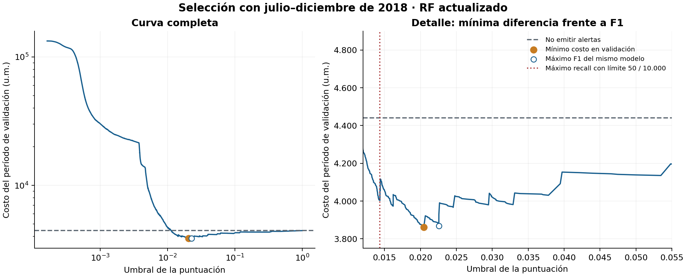
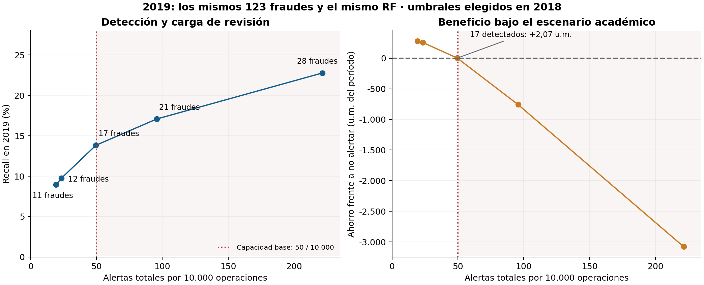
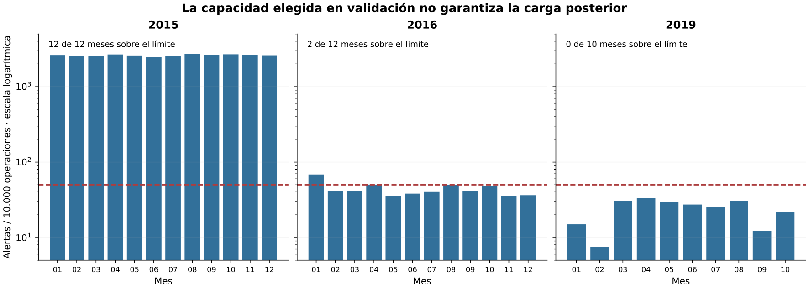

# Seguimiento temporal de recall y costo

Los ensayos usan **841.721 transacciones de desarrollo y 1.201 fraudes**. Excluyen los 148.540 identificadores del test S9 y no modifican su evaluación. Son estudios retrospectivos sobre desarrollo previamente explorado, no un nuevo test final independiente.

## Experimentos

| Carpeta | Alcance |
|---|---|
| [ronda1](ronda1/protocolo.json) | RF sin balanceo, submuestreo, SMOTENC y pesos de clase; tres ventanas, 12 ajustes. |
| [ronda2](ronda2/protocolo_ronda2.json) | Siete configuraciones RF adicionales; 21 ajustes; historia completa/reciente, profundidad y revisión de variables. |
| [ronda3](ronda3/protocolo_ronda3.json) | Dos configuraciones con contexto, tres ventanas y seis ajustes. Ninguna ganó los escenarios comparados. |
| [costos](costos/protocolo.json) | 13 candidatos, 39 curvas, 225 decisiones y 135 escenarios de sensibilidad. Cero ajustes nuevos en esta etapa. |
| [no_supervisado](no_supervisado/protocolo.json) | Tres Isolation Forest. Ajuste sin y; umbral operativo elegido con etiquetas de validación. Comparación separada de las 225 decisiones. |

R2 valida con el segundo semestre del año anterior, ampliado al año completo si no alcanza el soporte propuesto de 30 fraudes. Usa: entrenamiento hasta 2013/validación 2014/evaluación 2015; entrenamiento hasta junio 2015/validación segundo semestre/evaluación 2016; entrenamiento hasta junio 2018/validación segundo semestre/evaluación enero–octubre 2019. R1 valida con el año anterior completo. Cambian ventanas y variables entre rondas; no se atribuyen todas las diferencias al algoritmo.

Los años recientes sí tienen etiquetas positivas: desarrollo contiene 20 fraudes en 2017, 136 en 2018 y 123 en 2019. Excluir una ventana por soporte insuficiente no demuestra ausencia de fraudes en la fuente.

## Tres estrategias reales frente al desbalance

Submuestreo aleatorio, SMOTENC y `class_weight=balanced` son las tres estrategias, además de la referencia sin balanceo. Remuestreo e imputación se ajustan únicamente en entrenamiento. Validación y evaluación mantienen su prevalencia. SMOTENC se aplica antes de one-hot y respeta las entradas categóricas.

| R1, evaluación 2016, costo exploratorio FN=25/FP=1 | TP | FP | Recall | Precisión |
|---|---:|---:|---:|---:|
| Referencia | 73 | 44 | 0,3230 | 0,6239 |
| Submuestreo | 123 | 484 | 0,5442 | 0,2026 |
| SMOTENC | 132 | 732 | 0,5841 | 0,1528 |
| Pesos de clase | 149 | 600 | 0,6593 | 0,1989 |

Más detección se acompaña de más FP. En 2019 estas técnicas no sostienen una ventaja útil bajo ese escenario. Véase [comparación completa](ronda1/comparacion_temporal.csv). La política de no emitir alertas es una alternativa económica, no una ausencia de etiquetas.

## Matriz de costos principal

Los supuestos son académicos, no costos medidos de una institución:

| Realidad | Emitir alerta | No emitir alerta |
|---|---:|---:|
| Fraude | 3 u. m. de revisión | Pérdida evitable estimada del FN |
| Legítima | 3 u. m. de revisión | 0 en esta comparación |

Se proponen seis minutos por revisión y 30 u. m./hora: **3 u. m. por alerta**, incluidos TP. El FN se valora como 50 % del monto medio no negativo de fraudes de entrenamiento; para 2019 vale 64,35695738354806 u. m. El cálculo no elimina etiquetas y representa una porción supuestamente evitable como costo incremental; no supone pérdida bruta cero en cada TP.

`C = 3 × (TP + FP) + 64,35695738354806 × FN` en 2019.

Capacidad propuesta: 50 alertas por 10.000 operaciones, equivalentes a cinco horas de revisión. Se selecciona costo mínimo en validación sujeto a capacidad, con desempates determinísticos y opción de no alertar. Se recorren todos los puntos distintos de los scores, no solo 0,01–0,20. [Protocolo](costos/protocolo.json), [decisiones fijadas](costos/seleccion_fijada.json).

## Resultado de 2019

El RF temporal `rf_actualizado` se ajustó antes de julio de 2018. Su umbral por costo `0.02046171411871807` se eligió con el segundo semestre de 2018. El modelo S9 tiene otro artefacto y otro umbral.

| Política para el mismo RF temporal | TP | FP | FN | Recall | Costo (u. m.) |
|---|---:|---:|---:|---:|---:|
| No alertar | 0 | 0 | 123 | 0 % | 7.915,906 |
| Umbral por F1 en validación | 11 | 131 | 112 | 8,943 % | 7.633,979 |
| Umbral por costo en validación | 12 | 160 | 111 | 9,756 % | 7.659,622 |

Costo recuperó un fraude adicional con 29 FP adicionales y terminó 25,64 u. m. más caro que F1 en evaluación, aunque fue preferible en validación. No se reemplaza retrospectivamente la elección usando el periodo futuro. El ahorro de 256,28 u. m. se calcula frente a no alertar y depende de los supuestos.

El ganador F1 de todo el conjunto de candidatos cambia también el modelo. Para aislar el efecto del umbral debe utilizarse la comparación anterior.

## Frontera de recall y capacidad

Cada umbral se eligió en validación para el mismo RF; la tabla muestra la evaluación posterior.

| Capacidad por 10.000 | TP | FP | Recall | Alertas observadas por 10.000 | Costo (u. m.) |
|---|---:|---:|---:|---:|---:|
| 10 | 10 | 65 | 8,13 % | 10,21 | 7.497,34 |
| 25 | 12 | 160 | 9,76 % | 23,42 | 7.659,62 |
| 50 | 17 | 347 | 13,82 % | 49,56 | 7.913,84 |
| 100 | 21 | 682 | 17,07 % | 95,71 | 8.673,41 |
| 250 | 28 | 1.599 | 22,76 % | 221,52 | 10.994,91 |

Pasar de 12 a 17 fraudes recuperados añade 187 FP y 192 revisiones. El ahorro frente a no alertar cae a **2,07 u. m.** Seis de diez meses superan 50 alertas por 10.000 operaciones, aunque el promedio anual cumple. La política de 12 TP cumple el límite en los diez meses. La capacidad de 10 elegida en validación también se supera ligeramente en evaluación.

Estos puntos identifican un límite económico condicional dentro de las alternativas ensayadas. No prueban un recall máximo universal ni viabilidad con costos organizacionales reales.

## Tiempo y sensibilidad

| Año | Ganador por costo en validación | TP | FP | Recall | Meses sobre capacidad |
|---|---|---:|---:|---:|---:|
| 2015 | RF profundo | 119 | 22.882 | 62,63 % | 12/12 |
| 2016 | RF con variables revisadas | 155 | 231 | 68,58 % | 2/12 |
| 2019 | RF actualizado | 12 | 160 | 9,76 % | 0/10 |

Se cruzaron tres costos horarios, tres fracciones evitables, cinco capacidades y tres años: 135 escenarios. Los 45 de 2015 resultaron inviables; los 45 de 2016 cumplieron los criterios agregados; en 2019 los cumplieron 40 y cinco empeoraron el costo. Cumplimiento agregado no equivale a cumplimiento mensual ni disponibilidad de un sistema real.

## Isolation Forest y decisión

El detector ajusta X sin etiquetas; validación sirve para seleccionar el umbral. `-score_samples` es una puntuación de anomalía, no una probabilidad calibrada. En 2019 obtuvo PR-AUC 0,001855 y ROC-AUC 0,518158. Por costo/capacidad, validación eligió no alertar; por F1, recuperó cuatro fraudes con 1.547 FP. El RF temporal de referencia obtuvo PR-AUC 0,021818. [Resultados completos](no_supervisado/comparacion.csv).

Se conserva el RF S9 como referencia académica ligada a su evaluación. Sus limitaciones de recall y las del seguimiento temporal permanecen explícitas. No se promueven umbrales temporales a la aplicación ni se garantiza rendimiento posterior a 2019.

La [guía de reproducción](../../../src/evaluation/seguimiento/README.md) identifica datos, entornos, comandos y verificadores. Se versionan tablas y gráficos; datos individuales quedan fuera de Git. Los metadatos históricos mantienen las huellas de cada ejecución; los scripts adaptados generan nuevas carpetas sin sustituirlas.

Referencias: [scikit-learn: costo y umbral](https://scikit-learn.org/stable/auto_examples/model_selection/plot_cost_sensitive_learning.html), [métricas para fraude](https://fraud-detection-handbook.github.io/fraud-detection-handbook/Chapter_4_PerformanceMetrics/ThresholdBased.html), [capacidad de revisión](https://fraud-detection-handbook.github.io/fraud-detection-handbook/Chapter_4_PerformanceMetrics/TopKBased.html).

La comprobación adicional de Isolation Forest recalculó las 12 filas de comparación y las 12 selecciones de umbral; verificó las huellas de tres modelos y 256 puntuaciones tras recargar cada uno. Un archivo de predicciones de 2019 incompleto se regeneró desde su modelo guardado, conservando las puntuaciones existentes y las métricas; el guardado posterior utiliza archivos gzip completos y reemplazo atómico. Véase `no_supervisado/verificacion.json` y `no_supervisado/nota_persistencia.json`.
